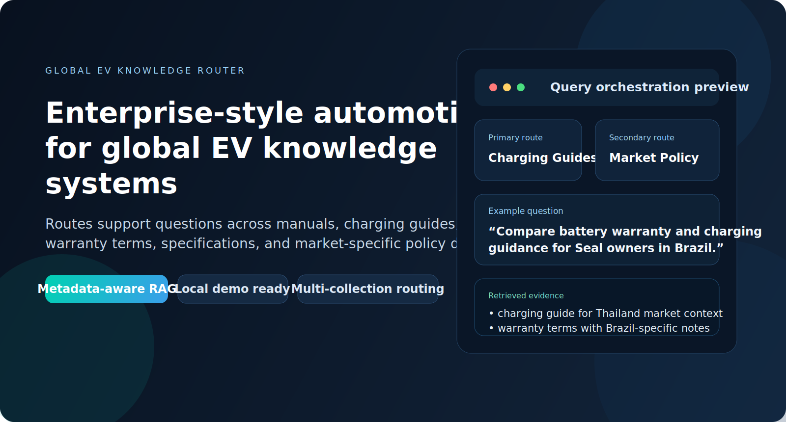
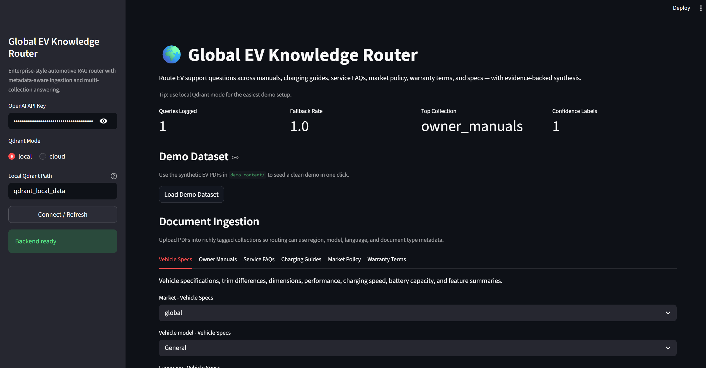
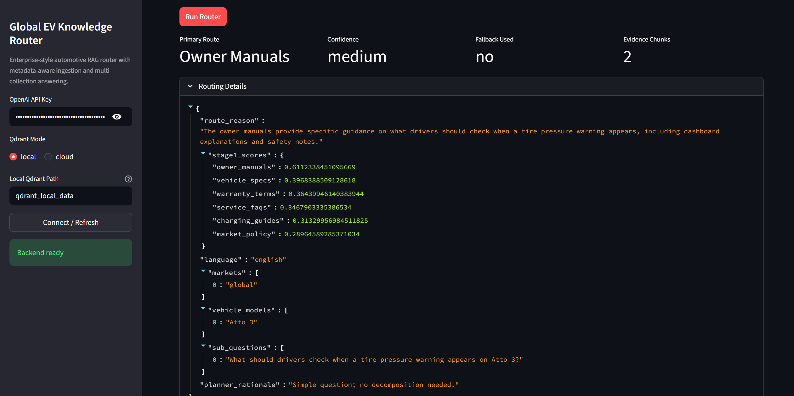
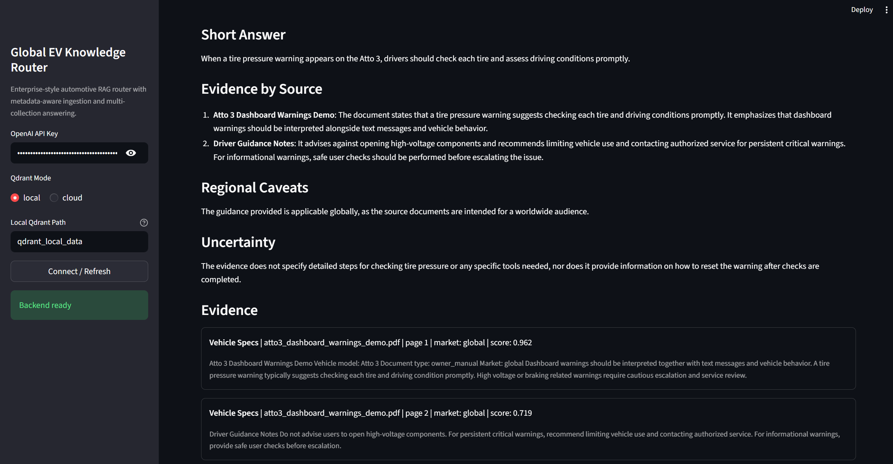
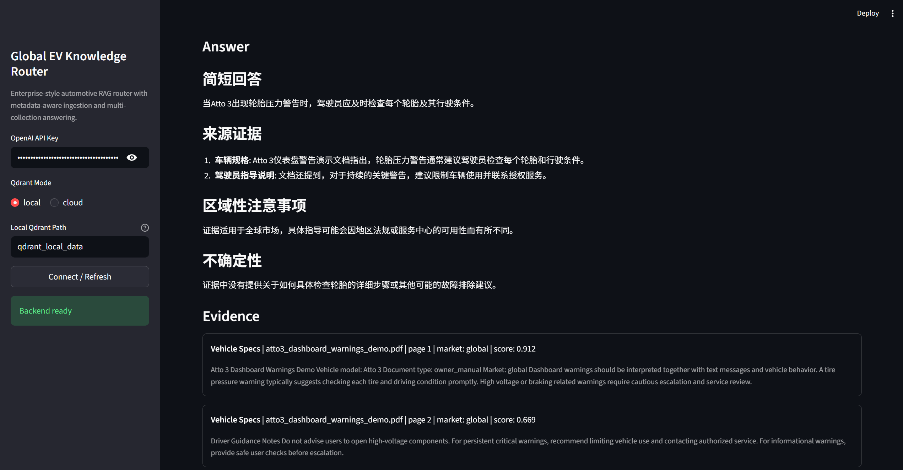
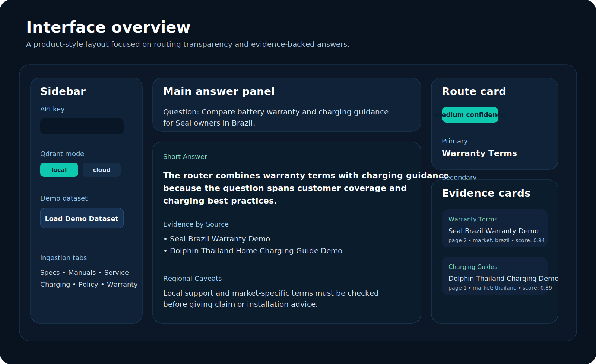
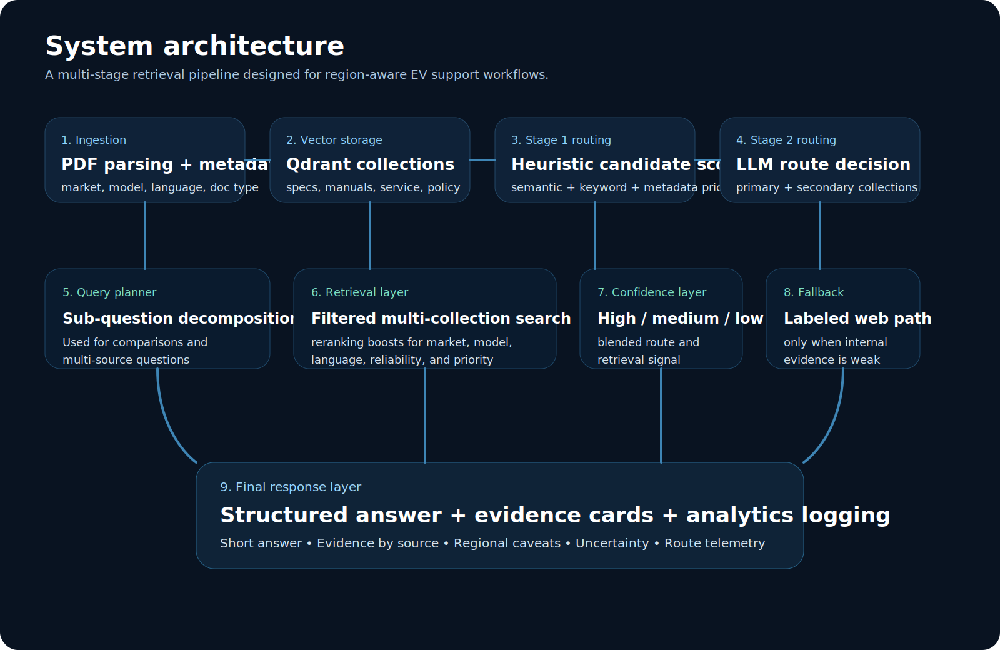
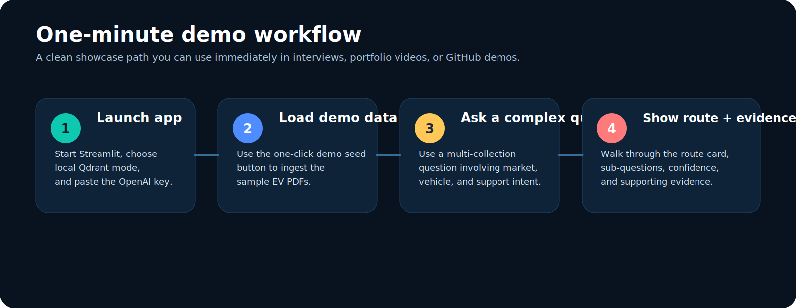

# 🌍 Global EV Knowledge Router

An enterprise-style automotive RAG system that routes EV support questions across manuals, charging guides, service FAQs, warranty terms, specifications, and market-specific policy documents — then synthesizes a single evidence-backed answer.



## Why this project matters

Generic RAG demos usually break when a user asks a question that spans:

- multiple document collections
- multiple markets or regions
- multiple support intents like `charging + warranty` or `manual + troubleshooting`

`Global EV Knowledge Router` is built to handle that more realistically.

Instead of pushing every question into one vector store, it:

- detects query context such as market, language, vehicle model, and complexity
- scores collection candidates before LLM routing
- supports multi-collection retrieval
- decomposes complex questions into smaller sub-questions
- labels fallback behavior when internal evidence is weak

## What this demonstrates

This repo is designed to signal strong applied-LLM and product-engineering skills:

- metadata-aware RAG design
- multi-stage routing
- enterprise retrieval architecture
- confidence-based answer policies
- demo-ready local setup
- clean UI and portfolio presentation

## Visual Overview

### Real App Screenshots

#### 1. Dashboard and ingestion workflow

This screen shows the main app shell: sidebar configuration, analytics summary, demo dataset loader, and the document-ingestion tabs.



#### 2. Routing decision and trace details

This screen shows the routed collection, confidence level, fallback status, evidence count, and the detailed routing trace used to explain why the query was classified the way it was.



#### 3. Structured answer in English

This screen shows the answer format used for recruiter demos: short answer, evidence-by-source, regional caveats, uncertainty, and citation-backed evidence cards.



#### 4. Structured answer in Chinese

This screen demonstrates multilingual output, showing the same evidence-backed answer style in Chinese for global EV support use cases.



### UI Concept

The following visual is a simplified layout concept that summarizes the product structure at a glance.



### Architecture



### Demo Flow



## Core Features

- **Config-driven collections** using `data/collections.json`
- **Metadata-rich ingestion** with market, vehicle model, language, doc type, model year, version, and source reliability
- **Two-stage routing** using heuristic scoring plus LLM route selection
- **Query planning** for complex comparison-style questions
- **Multi-collection retrieval** with score boosts for region/model relevance
- **Confidence labels** for high, medium, and low-evidence cases
- **Labeled fallback** to external search when internal evidence is weak
- **Analytics logging** for route usage, fallback rate, and confidence distribution
- **Local demo mode** using embedded Qdrant storage
- **One-click demo dataset seeding** with synthetic EV PDFs

## Quick Demo

This is the fastest way to showcase the project after cloning it.

### 1. Create and activate the virtual environment

```bash
py -3 -m venv .venv
.venv\Scripts\activate
```

### 2. Install dependencies

```bash
pip install -r requirements.txt
```

### 3. Launch the app

```bash
streamlit run app.py
```

### 4. Use the easiest demo setup

Inside the app:

- paste your `OpenAI API key`
- keep `Qdrant Mode` set to `local`
- click `Connect / Refresh`
- click `Load Demo Dataset`

### 5. Ask a portfolio-worthy question

Try one of these:

- `What is the recommended AC charging setup for Dolphin owners in Thailand?`
- `Compare battery warranty and charging guidance for Seal owners in Brazil.`
- `Summarize dashboard warning guidance and service FAQ advice for Atto 3 owners.`
- `For a customer in Hungary, summarize charger installation precautions and charging guidance.`

More examples live in `demo_content/demo_queries.md`.

## Demo Dataset

This repo includes synthetic, public-safe EV documents so you can demo the system without using internal or copyrighted company data.

Included demo documents:

- `demo_content/vehicle_specs/seal_global_specs_demo.pdf`
- `demo_content/charging_guides/dolphin_thailand_home_charging_demo.pdf`
- `demo_content/warranty_terms/seal_brazil_warranty_demo.pdf`
- `demo_content/owner_manuals/atto3_dashboard_warnings_demo.pdf`
- `demo_content/service_faqs/global_service_troubleshooting_demo.pdf`
- `demo_content/market_policy/hungary_home_charger_installation_demo.pdf`

If needed, regenerate them with:

```bash
python demo_content/generate_demo_pdfs.py
```

## How It Works

### 1. Query Context Detection

The system inspects the question for:

- language
- market hints
- vehicle model mentions
- complexity
- likely document types

### 2. Stage 1 Candidate Scoring

Collections are ranked using a blend of:

- semantic similarity to collection summaries
- keyword priors
- region hints
- document-type relevance
- collection priority

### 3. Stage 2 LLM Route Decision

The router model selects:

- `primary_collection`
- `secondary_collections`
- `confidence`
- `needs_multi_collection`
- route reasoning

### 4. Query Planning

If the question is complex, the planner can split it into smaller retrieval-ready sub-questions before search.

### 5. Retrieval and Reranking

The retrieval layer searches across the selected collections using metadata-aware filters and score adjustments for:

- market match
- vehicle model match
- language match
- source reliability
- collection priority

### 6. Answer Synthesis

The final response is structured with:

- `Short Answer`
- `Evidence by Source`
- `Regional Caveats`
- `Uncertainty`

### 7. Fallback Behavior

If internal evidence is too weak, the app switches to a clearly labeled external fallback path.

## Project Structure

```text
rag_database_routing/
├── app.py
├── analytics.py
├── backend.py
├── config.py
├── demo_seed.py
├── fallback.py
├── ingestion.py
├── planner.py
├── retrieval.py
├── router.py
├── synthesizer.py
├── state.py
├── assets/
├── data/
├── demo_content/
└── evals/
```

## Collections

The default collections are defined in `data/collections.json`:

- `vehicle_specs`
- `owner_manuals`
- `service_faqs`
- `charging_guides`
- `market_policy`
- `warranty_terms`

This makes the project easy to extend into new product or support domains.

## Analytics and Evaluation

The app logs query events to:

- `analytics/events.jsonl`

Starter evaluation scaffolding is provided in:

- `evals/router_eval.json`

Suggested metrics:

- route accuracy
- top-2 route recall
- citation precision
- fallback precision
- region-awareness accuracy

## Tech Stack

- `Python`
- `Streamlit`
- `OpenAI`
- `Qdrant`
- `LangChain`
- `DuckDuckGo Search`

## Why it’s GitHub-ready

This repo is already polished for public portfolio use:

- runs with a local vector store
- includes synthetic demo documents
- includes custom README visuals
- has a clear architecture story
- has a repeatable demo flow
- avoids any company-specific branding or confidential data

## Suggested Public Repo Name

Use:

```text
global-ev-knowledge-router
```

## Suggested GitHub Description

Use:

```text
Enterprise-style automotive RAG system for routing EV support questions across manuals, charging guides, warranty terms, service FAQs, and market-specific policy documents.
```

## Inspiration

This project began from an open-source routing tutorial and was substantially redesigned into a domain-specific EV knowledge system with modular architecture, local demo mode, seeded demo content, analytics, and a portfolio-focused product presentation.

## Notes

- Use public or self-created documents only.
- Do not upload confidential or copyrighted internal company files.
- For local demos, embedded Qdrant mode is the easiest setup.
